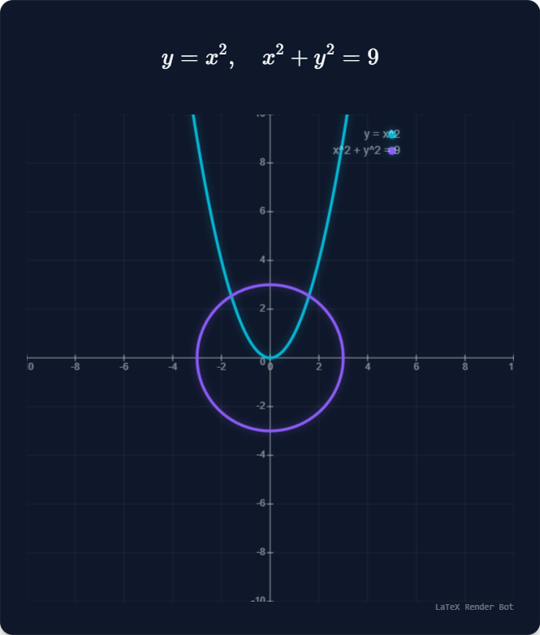
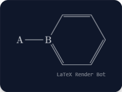

# MathCourier

[](https://github.com/SulkBash/MathCourier/actions/workflows/ci.yml)

Render equations, plots, solver output, chemistry, and animated math visuals directly inside WhatsApp.

<p align="center">
  
</p>

MathCourier is a local-first WhatsApp bot built with `whatsapp-web.js`, `Puppeteer`, `KaTeX`, `mathjs`, and Python/SymPy backends. It works in group chats and DMs, turns math commands into polished PNG cards, and can export animated 2D and 3D scenes as MP4 clips when `ffmpeg` is available.

## Highlights

- Tiny public command surface: `!latex`, `!plot`, `!solve`, and `!help`
- Auto-render inline `$$ ... $$` blocks inside ordinary chat messages
- 2D plotting for explicit, implicit, parametric, polar, and vector-field expressions, including `animate:` videos
- 3D plotting for surfaces, implicit volumes, curves, vector fields, and camera animations
- Symbolic and numeric solving for algebra, calculus, matrices, ODEs, PDEs, and variable isolation
- Chemistry, `chemfig`, TikZ, and `circuitikz` support through the unified `!latex` command
- Local Puppeteer rendering first, with fallback engines available for resiliency

## Preview

<table>
  <tr>
    <td align="center">
      
      <br>
      <sub><code>!plot y = x^2, x^2 + y^2 = 9</code></sub>
    </td>
    <td align="center">
      
      <br>
      <sub><code>!plot (-y, x) kind:vector x:[-5, 5] y:[-5, 5]</code></sub>
    </td>
    <td align="center">
      
      <br>
      <sub><code>!plot (...) view:3d kind:surface vars:{u, v}</code></sub>
    </td>
  </tr>
  <tr>
    <td align="center">
      
      <br>
      <sub><code>!solve x + y = 5; x - y = 1</code></sub>
    </td>
    <td align="center">
      
      <br>
      <sub><code>!latex &lt;circuitikz diagram&gt;</code></sub>
    </td>
    <td align="center">
      
      <br>
      <sub><code>!latex \chemfig{A-B*6(=-=-=-)}</code></sub>
    </td>
  </tr>
</table>

## Command Overview

| Command | Use it for | Example |
| --- | --- | --- |
| `!latex <content>` | Formulas, mixed text, chemistry, `chemfig`, TikZ, and `circuitikz` | `!latex \sum_{i=1}^{n} i = \frac{n(n+1)}{2}` |
| `!plot <expression> [options]` | 2D plots, 3D plots, vector fields, parametric curves, and animations | `!plot z = sin(x)*cos(y) view:3d x:[-3, 3] y:[-3, 3]` |
| `!solve <expression> [options]` | Equations, calculus, matrices, ODEs, PDEs, and variable isolation | `!solve integ[sin(x), x:[0, pi]]` |
| `!help [topic]` | Syntax help, command help, helper docs, and option docs | `!help plot` |

## Syntax Tips

- Ranges use brackets: `x:[min, max]`, `y:[min, max]`, `z:[min, max]`
- Scalar options use `key:value`, such as `view:3d` or `kind:vector`
- Grouped options use braces: `vars:{x, y, z}`, `ic:{y(0)=1; y'(0)=0}`
- Semicolons separate systems of equations and matrix rows: `x + y = 5; x - y = 1`, `[1, 2; 3, 4]`
- Use `kind:parametric`, `kind:polar`, or `kind:vector` when a tuple would otherwise be ambiguous
- Use `animate:<param>` to animate 2D or 3D plots; `camera:<axis>` is 3D-only

## Quick Start

### Prerequisites

- Node.js 20.x
- npm 10.x
- Python 3 available as `python`, `python3`, or via `PYTHON_BIN` / `runtime.pythonBin`
- Chromium or Chrome available to Puppeteer. If auto-detection is not enough on your host, set `PUPPETEER_EXECUTABLE_PATH` or `CHROME_BIN`, or edit `runtime.browserExecutablePath` in `config.js`.
- Python packages: `sympy`, `numpy`, and `scipy`
- Optional: `ffmpeg` on `PATH` or via `FFMPEG_BIN` / `runtime.ffmpegBin` for animated 2D and 3D MP4 output

Tested during the current package-hardening pass with Node `20.19.5` and npm `10.8.2`. The Python bridge expects a working Python 3 interpreter plus the required packages, and `npm run doctor` is the source of truth for whether your local environment is ready.

### Install

```bash
npm install
pip install sympy numpy scipy
npm run doctor
```

The repo intentionally remains terminal-first. There is no separate setup UI; `npm run doctor` is the local setup/status entry point before QR auth or full startup.

If your browser binary, auth directory, or cache directory lives somewhere non-default, set the matching environment variable first or edit the `runtime.*` keys in `config.js` before you run `npm run doctor`.

### Installation trust

Use this order if you want the lowest-friction way to inspect the repo before logging into WhatsApp:

1. `npm install` and `pip install sympy numpy scipy`
2. `npm run doctor`
3. `npm test`
4. `npm start`

What each step does:

- `npm install` pulls Node dependencies from the npm registry; depending on your Puppeteer environment, it may also provision browser assets needed for local rendering.
- `pip install ...` pulls the Python packages needed for symbolic solve, calculus, ODE, and PDE routes.
- `npm run doctor` validates Node, Python, Chromium/Chrome, `ffmpeg`, writable runtime directories, and bot bootstrap wiring. It launches a local headless-browser smoke check, but it does not start WhatsApp login and does not intentionally call QuickLaTeX or CodeCogs.
- `npm test` stays local and writes smoke-test output to `test_output/`.
- `npm start` is the first step that opens the actual WhatsApp client flow and uses or creates session data under the configured auth/cache directories.

If you want to inspect the setup check before running it, the entry point is [`scripts/doctor.js`](scripts/doctor.js).

### Smoke-test the renderer

```bash
npm test
```

This writes sample output to `test_output/` so you can verify that Puppeteer, KaTeX, and plotting are working before connecting the bot to WhatsApp.

### Useful package commands

```bash
npm run doctor
npm run test:startup
npm run test:core
npm run test:plot-anim
npm run test:renderers
npm run test:ci
```

- `npm test` / `npm run test:smoke`: local renderer smoke test
- `npm run test:startup`: startup/bootstrap smoke for the bot wiring and renderer path without opening a live WhatsApp login flow
- `npm run test:core`: parser, help, router, solver, calculus, vector, matrix, and ODE checks
- `npm run test:plot-anim`: 2D animation regression suite for explicit, implicit, parametric, polar, and vector plots
- `npm run test:renderers`: smoke plus renderer-focused checks, including release-gated 2D animation, 3D, and PDE integration suites
- `npm run test:ci`: canonical release verification command for CI and pre-publish checks

GitHub Actions runs `npm run doctor`, `npm run test:startup`, and `npm run test:ci` on `windows-latest`, `ubuntu-latest`, and `macos-latest` for every push and pull request. The badge at the top of this README reflects that workflow.

### Run the bot

```bash
npm start
```

1. Scan the QR code from WhatsApp -> Linked Devices.
2. The login session is stored under `runtime.whatsappAuthPath` (default: `.wwebjs_auth/`), so you normally only scan once.

## Runtime Versions

| Runtime | Current policy | Current verified example |
| --- | --- | --- |
| Node.js | Supported baseline: `20.x` | `20.19.5` |
| npm | Supported baseline: `10.x` | `10.8.2` |
| Python | Required: Python `3.x` plus `sympy`, `numpy`, and `scipy`; readiness is gated by `npm run doctor` rather than a narrow hard pin | Local docs pass detected `3.14.0` |
| `ffmpeg` | Optional; used for animated 2D and 3D MP4 output | If missing, animated requests degrade to a static preview |

## Host Support And Runtime Paths

| Environment | Support level | Notes |
| --- | --- | --- |
| Windows local workstation | Validated | Current known-good public path: `npm run doctor`, `npm test`, `npm run test:ci`, `npm start` |
| GitHub Actions matrix (`windows-latest`, `ubuntu-latest`, `macos-latest`) | Automated | CI runs `npm run doctor`, `npm run test:startup`, and `npm run test:ci` |
| Linux bare-metal or VM | Supported (CI-verified) | Matches the Ubuntu release gate; preserve auth/cache dirs across restarts and install distro Chromium dependencies when needed |
| macOS workstation/server | Supported (CI-verified) | Matches the macOS release gate; install Python 3 plus Chrome/Chromium and use browser-path overrides if needed |
| Containerized hosting | Not part of the initial public support promise | Treat as unsupported for the first public release unless you are comfortable debugging host-specific issues |

Known Linux host prerequisites to check before startup:

- Python 3 with `sympy`, `numpy`, and `scipy`
- Chrome or Chromium plus common Puppeteer libraries such as `libnss3`, `libatk-bridge2.0-0`, `libgtk-3-0`, and `libasound2` where your distro requires them
- Optional `ffmpeg` for animated 2D and 3D MP4 output

Persistent runtime data:

- WhatsApp auth root: `runtime.whatsappAuthPath` or `WWEBJS_AUTH_PATH`, default `.wwebjs_auth/`
- WhatsApp web cache: `runtime.whatsappCachePath` or `WWEBJS_CACHE_PATH`, default `.wwebjs_cache/`
- Renderer cache: `runtime.rendererCachePath` or `RENDERER_CACHE_PATH`, default `runtime_cache/renderer/`
- Optional multi-instance session suffix: `runtime.whatsappClientId` or `WWEBJS_CLIENT_ID`

Preserve the auth root and web cache across restarts if you want to avoid scanning a new QR code after every restart.

WhatsApp QR auth itself is still a manual step on every host because it requires a real account. The automated cross-platform gate validates runtime discovery, browser startup, renderer startup, and the documented release test suite.

## Network Behavior

| Path | Third-party network use | When it happens |
| --- | --- | --- |
| `npm install` | Yes | Pulls npm packages; Puppeteer may also provision browser assets depending on your install environment |
| `pip install sympy numpy scipy` | Yes | Pulls Python packages from your configured package index |
| `npm run doctor` | No intentional third-party render/API traffic | Local environment validation only |
| `npm test` / `npm run test:smoke` | No intentional third-party render/API traffic | Local renderer smoke test only |
| `npm start` | Yes | Starts the WhatsApp client flow and normal runtime messaging/session traffic |
| `!latex` formula rendering | Usually local | Uses local KaTeX first; CodeCogs is only used if local formula rendering fails and fallback remains enabled |
| `!latex` `\ce{...}` chemistry notation | Local | Rendered by KaTeX with the bundled `mhchem` helper |
| `!latex` `chemfig`, TikZ, `circuitikz` | Yes | Uses QuickLaTeX |
| `!plot` / `!solve` / local plot rendering | No intentional third-party render/API traffic | Uses local Puppeteer rendering and local Python subprocesses where needed |

## Privacy And Repo Safety

- WhatsApp session state stays local in the configured auth/cache roots (`.wwebjs_auth/` and `.wwebjs_cache/` by default); those directories are gitignored.
- Generated output and scratch/runtime cache directories such as `test_output/`, `scratch/`, `.cache/`, `.tmp/`, `tmp/`, and `runtime_cache/` are local-only and not part of the published repo surface.
- The preview images under `assets/readme/` are generated sample outputs from this project, not screenshots of live chats, QR codes, or personal account data.

## Community And Support

- Contribution workflow: [`.github/CONTRIBUTING.md`](.github/CONTRIBUTING.md)
- Support posture: [`.github/SUPPORT.md`](.github/SUPPORT.md)
- Security reporting: [`.github/SECURITY.md`](.github/SECURITY.md)
- Code of conduct: [`.github/CODE_OF_CONDUCT.md`](.github/CODE_OF_CONDUCT.md)

Bug reports, feature ideas, and setup/use questions should go through the GitHub issue templates. Security-sensitive reports should follow the private reporting guidance in `SECURITY.md` instead of opening a public issue.
Public release history lives in GitHub Releases rather than a tracked `CHANGELOG.md` at this stage.

## Known Limitations

- Containerized hosting is outside the initial public support promise.
- Animated output depends on `ffmpeg`; without it, the bot falls back to a static preview image.
- `chemfig`, TikZ, and `circuitikz` rendering depend on QuickLaTeX rather than staying fully local.
- Formula fallback depends on CodeCogs when local formula rendering fails and `bot.useFallback` remains enabled.
- `whatsapp-web.js` is unofficial, so upstream WhatsApp changes can break login or messaging behavior without warning.

## Non-Goals

- Adding many top-level commands beyond `!latex`, `!plot`, `!solve`, and `!help`
- Shipping a GUI setup/status surface instead of the current terminal-first workflow
- Treating containerized hosting as a first-class supported environment in the first public release
- Publishing this project as an npm package

## Example Commands

### `!latex`

```text
!latex \sum_{i=1}^{n} i = \frac{n(n+1)}{2}
!latex \ce{CO2 + H2O <=> H2CO3}
!latex \chemfig{A-B*6(=-=-=-)}
!latex
\draw (0,0) to[R, l=$R$] (2,0)
      to[C, l=$C$] (2,2)
      to[L, l=$L$] (0,2)
      to[V, l=$V$] (0,0);
```

Another standalone formula example:

```text
!latex \int_0^\infty e^{-x^2} \, dx = \frac{\sqrt{\pi}}{2}
```

### `!plot`

```text
!plot sin(x) * cos(x/2)
!plot y = sin(x) animate:x x:[-10, 10] y:[-2, 2]
!plot x^2 + y^2 = 1
!plot y = sin(x - t) animate:t x:[-10, 10] y:[-2, 2] t:[0, 2*pi]
!plot (cos(3*t), sin(2*t)) kind:parametric t:[0, 2*pi]
!plot (cos(3*t), sin(2*t)) kind:parametric animate:t t:[0, 2*pi] x:[-2, 2] y:[-2, 2]
!plot (-y, x) kind:vector x:[-5, 5] y:[-5, 5]
!plot (-y, x) kind:vector animate:x x:[-5, 5] y:[-5, 5]
!plot r = 1 + cos(theta) kind:polar animate:theta theta:[0, 2*pi] x:[-2.5, 2.5] y:[-2.5, 2.5]
!plot z = sin(x)*cos(y) view:3d x:[-3, 3] y:[-3, 3]
!plot z = sin(x - t)*cos(y) view:3d animate:t x:[-3, 3] y:[-3, 3] t:[0, 2*pi]
```

### `!solve`

```text
!solve x^2 - 5x + 6 = 0
!solve x + y = 5; x - y = 1
!solve E = m * c^2 vars:c
!solve deriv[x^2 * sin(x), x]
!solve curl[(-y, x, 0), vars:{x, y, z}]
!solve [1, 2; 3, 4] * [2, 0; 1, 2]
!solve dy/dx = -y ic:{y(0)=1}
```

## Dependency Notes

- Direct npm dependencies are pinned to exact registry releases and locked in `package-lock.json` for reproducible installs.
- `whatsapp-web.js` is an unofficial WhatsApp Web client. It is the main maintenance-risk dependency in this project because upstream WhatsApp changes can break login or messaging behavior without warning.
- `puppeteer` is part of the supported local render path and may require a working Chromium/Chrome environment depending on your host setup.
- Some rendering paths may contact third-party services: QuickLaTeX for `chemfig`/TikZ/circuit diagrams and CodeCogs for formula fallback rendering when fallback mode is enabled.
- Public-release audit policy: install-blocking issues and high-severity dependency problems are blockers; lower-severity findings still need triage and an explicit follow-up plan before release.

## Configuration

Most runtime and visual tuning lives in [`config.js`](config.js):

- `style.*` controls card colors, typography, padding, graph sizing, and watermark styling
- `bot.*` controls command behavior, auto-rendering, fallbacks, 3D concurrency, and 2D/3D animation defaults
- `puppeteer.launchArgs.*` controls Chromium launch flags
- `runtime.pythonBin` overrides the Python interpreter used by solver subprocesses
- `runtime.browserExecutablePath` overrides the Chrome/Chromium executable used by Puppeteer
- `runtime.ffmpegBin` overrides the ffmpeg executable used for animated plot MP4 assembly
- `runtime.whatsappAuthPath`, `runtime.whatsappCachePath`, and `runtime.rendererCachePath` control persisted auth/cache/runtime directories
- `runtime.whatsappClientId` adds a stable `session-<id>` suffix when you need multiple bot instances

If you want a clean output without branding, set `style.watermark.text` to `''`.

## Architecture At A Glance

```text
WhatsApp message
  -> bot.js
  -> src/commands/{latex,plot,solve}.js
  -> src/renderer/* or src/solver/*
  -> PNG / MP4 reply
```

- `src/renderer/` handles KaTeX cards, 2D plots, 3D Plotly renders, and fallback routing
- `src/solver/` combines fast JS-side math with Python subprocess backends
- `python/*.py` speak JSON over stdin/stdout for symbolic solving, calculus, ODEs, and PDEs

## Troubleshooting

- If QR login gets stuck, stop the bot, remove the configured WhatsApp auth directory (default `.wwebjs_auth/`), and start again
- If symbolic solving fails, run `npm run doctor`. If needed, point the solver bridge at a specific interpreter with `PYTHON_BIN` or `runtime.pythonBin`.
- If animated output falls back to a static image, install `ffmpeg` or point to it explicitly with `FFMPEG_BIN` or `runtime.ffmpegBin`.
- If local rendering fails, run `npm run doctor` and verify that Puppeteer can find a usable Chrome/Chromium executable. Set `PUPPETEER_EXECUTABLE_PATH`, `CHROME_BIN`, or `runtime.browserExecutablePath` when the browser lives in a custom location.

## Disclaimer
This project is not affiliated with, endorsed by, sponsored by, or officially connected to WhatsApp, WhatsApp LLC, Meta Platforms, Inc., or any of their subsidiaries. The official WhatsApp website can be found at whatsapp.com. "WhatsApp" as well as related names, marks, emblems, and images are registered trademarks of their respective owners. Also, it is not guaranteed that you will not be blocked by using this method. WhatsApp does not allow bots or unofficial clients on their platform, so use this integration at your own risk.

## License

Released under the [MIT License](LICENSE).
